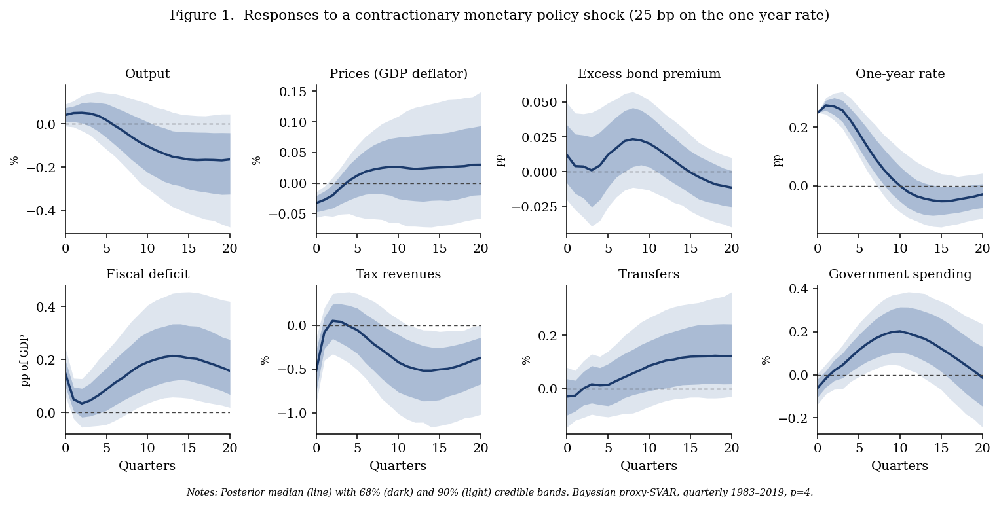
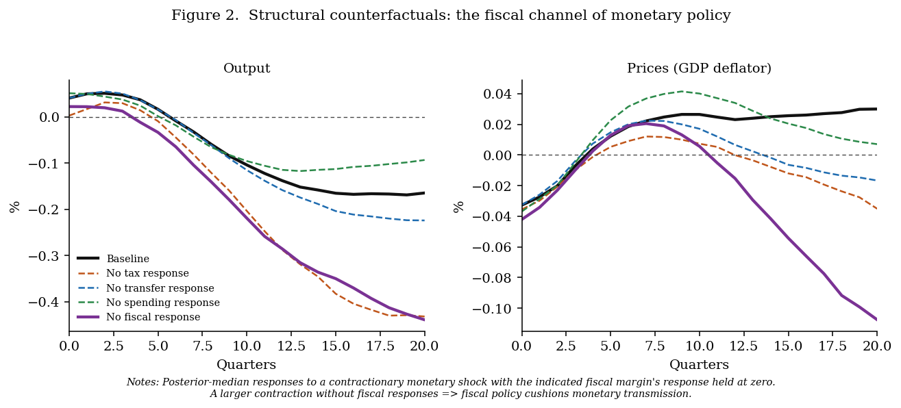
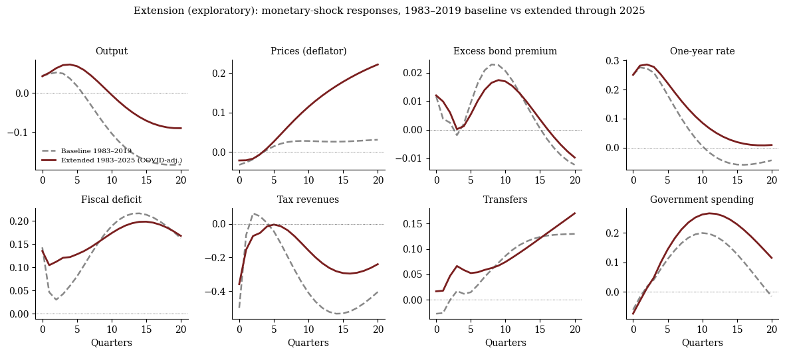

# The Fiscal Channel of Monetary Policy — Replication & Extension

A transparent, fully reproducible replication of **Breitenlechner, Geiger & Klein,
*"The Fiscal Channel of Monetary Policy"*** (Innsbruck WP 2024-07; forthcoming, *Journal of
Political Economy: Macroeconomics*), built from public data — plus an exploratory post-pandemic
extension.

**Status:** core replication complete (Phases 0–5). Qualitative match to the paper's results
achieved from public data; a decimal-exact match is pending the authors' exact monetary-surprise
vintage (see *Honest boundary* below).

---

## What the paper finds

A contractionary monetary policy shock lowers output and prices **and** triggers a pronounced
fiscal adjustment — the deficit rises, tax revenues fall, transfers rise. Structural
counterfactuals then show that these endogenous fiscal responses *shape* the transmission of
monetary policy: the tax system cushions the output effect, and transfers mute the price effect.

## What this repository does

It reconstructs that entire empirical pipeline end-to-end: raw data → the eight-variable
quarterly dataset (Table A.1 spec) → the four identification proxies → a Bayesian proxy-SVAR
(Arias–Rubio-Ramírez–Waggoner 2021) → the structural counterfactuals — and reproduces the paper's
central results.

---

## Headline results

**1. The fiscal channel — responses to a contractionary monetary shock.**
A tightening lowers output, raises the excess bond premium, and drives the deficit up, taxes down,
transfers up.



**2. The structural counterfactuals — the fiscal channel quantified.**
Switching off the fiscal responses produces a *larger* contraction: endogenous fiscal policy
**cushions ~62% of the output effect (via taxes)** and **mutes the price effect (via transfers)**.



**3. A methodological contribution.** The monetary shock initially showed an "output puzzle."
We diagnosed it as **temporal aggregation of the high-frequency surprise** (proven via a
monthly-vs-quarterly test) and fixed it by weighting each FOMC surprise by its exact within-quarter
timing — resolving the puzzle *with a strong instrument (first-stage F ≈ 17.5)*. Both the
information-robust proxy **and** the timing fix are necessary (see `Outputs/Tables/exp1b_*`,
`exp2_*`).

**4. Post-pandemic extension (exploratory).** Extended through 2025, the fiscal channel persists —
deficit/transfer responses are robust and the **interest-payment/spending margin strengthens**
during the 2022–23 tightening — while output/price transmission becomes harder to identify at the
zero lower bound.



---

## Honest boundary (what matches, what doesn't)

This is a **qualitative** replication — correct mechanisms, correct signs, sensible magnitudes —
not yet a decimal-exact match. The remaining gap is the authors' **exact FF4 monetary-surprise
series and their quarterly aggregation method**; we showed aggregation drives the output sign, so
their precise construction is what would close the magnitudes. The request is drafted in
`Documentation/Author_Data_Request_DRAFT.md`. Everything else (variables, EBP vintage, proxy
construction) is reproduced from public sources and verified.

---

## Repository structure

```
Code/BPSVAR/        30 → 41  reduced-form BVAR, proxy identification, counterfactuals,
                             experiments, publication figures, extension
Code/Analysis/      20       Track A frequentist sanity check
Code/Data_Download/ 01       corrected data foundation (Table A.1)
Data_Processing/    Cleaned_Data (proxies, series) · Final_VAR_Dataset (VAR inputs)
Raw_Data/           FRED · Monetary_Shocks · External_Datasets (EBP, fiscal proxies)
Outputs/            Figures · IRFs · Tables · VAR (posterior draws .rds)
Documentation/      logbook, data dictionary, memos, proposals, supervisor notes
```

## Reproduce it

Scripts are numbered in execution order (base R; a FRED API key needed only for `01`):

1. `Code/Data_Download/01_build_baseline_dataset.R` — build the dataset (Table A.1).
2. `Code/BPSVAR/30_bvar_minnesota_stage1.R` — reduced-form Minnesota BVAR (saves posterior draws).
3. `Code/BPSVAR/31_proxy_identification_stage2.R` — identify the four shocks (baseline IRFs).
4. `Code/BPSVAR/34_counterfactuals_stage3.R` — the structural counterfactuals.
5. `Code/BPSVAR/40_publication_figures.R` — paper-style figures & tables.
   Robustness / extension: `32`, `33`, `35` (aggregation & proxy experiments), `41` (extension).

## Key documents

| Document | What it is |
|---|---|
| `Documentation/Replication_Log/00_replication_logbook.md` | Full decision log (22 entries) — the project's audit trail |
| `Documentation/Progress_Report_2026-08-07.md` | Stage-by-stage progress report |
| `Documentation/Supervisor_Meeting_Notes.md` | Meeting talking points (incl. the aggregation finding) |
| `Documentation/Author_Data_Request_DRAFT.md` | Drafted request to the authors for the exact-magnitude match |
| `Documentation/Extension_Proposal_PostPandemic.md` | The post-pandemic extension design |
| `Documentation/data_dictionary.md` · `proxy_sourcing_map.md` | Every variable & proxy: source, code, transform |

## Data provenance

All series trace to public sources: FRED (Table A.1 codes), the Favara et al. (2016) updated
Gilchrist–Zakrajšek EBP (Fed Board), Jarociński–Karadi high-frequency monetary surprises, and the
Mertens–Ravn / Romer–Romer / Auerbach–Gorodnichenko fiscal proxies (extended; see
`proxy_sourcing_map.md`). Raw files are archived under `Raw_Data/`.
